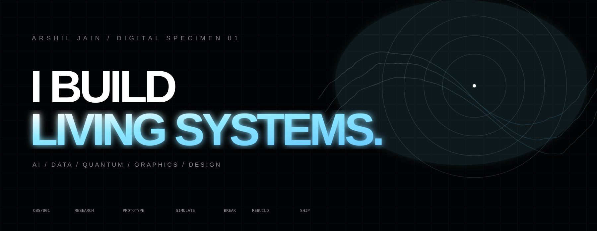
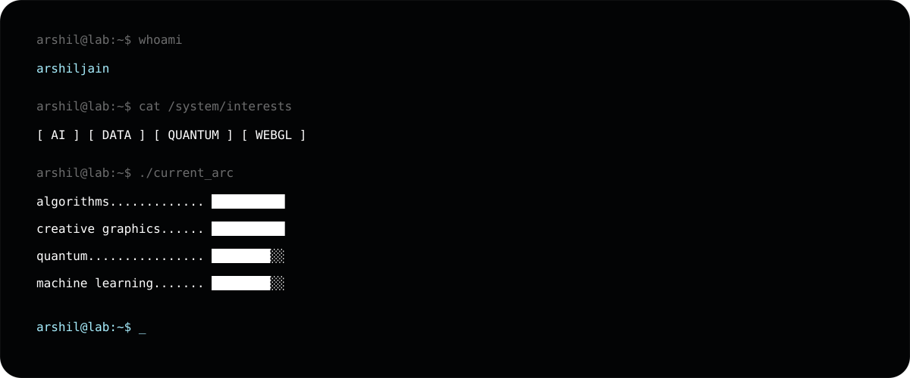
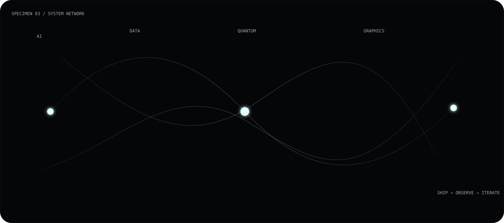
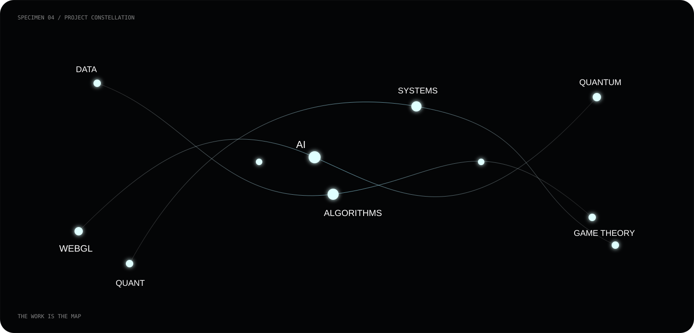
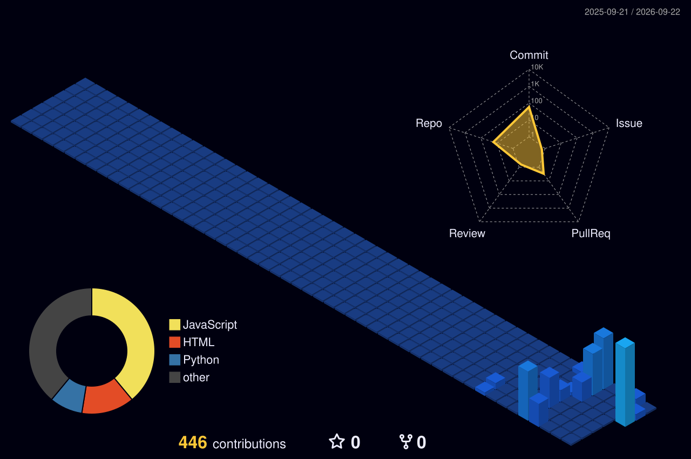

 

 

### COMPUTATIONAL ARTIFACT / 2026

AI &nbsp; DATA &nbsp; QUANTUM &nbsp; WEBGL &nbsp; ALGORITHMS &nbsp; SYSTEMS

---

## 01 — THE WORK

<table>
<tr>
<td width="53%" valign="top">

</td>
<td width="47%" valign="middle">

### I LIKE THE SPACE BETWEEN THINGS.

Software + mathematics.

Machines + interfaces.

Models + strategy.

Pixels + systems.

I build to understand.

I research to make the strange computable.

I design so the result feels alive.

</td>
</tr>
</table>

---

---

## 02 — PROJECT CONSTELLATION

<table>
<tr>
<td width="25%" align="center"><b>WEBGL</b> shaders / gpu</td>
<td width="25%" align="center"><b>AI</b> models / data</td>
<td width="25%" align="center"><b>QUANTUM</b> qiskit / circuits</td>
<td width="25%" align="center"><b>DSA</b> algorithms / systems</td>
</tr>
</table>

### Selected coordinates

**◉ [Lusion Systems](https://github.com/arshiljain/lusionw)**  
Graphics architecture, custom GLSL, GPGPU dynamics, mathematical geometry.

**△ [Algorithm Laboratory](https://github.com/arshiljain/DSAPP)**  
Readable algorithms, tests, numerical experiments and computational notebooks.

**◇ [Creative Web](https://github.com/arshiljain/portfolio)**  
Art-directed frontend experiments, motion and visual systems.

**⌘ [Developer Lab](https://github.com/arshiljain/Github-Bot)**  
Private GitHub automation and tooling experiments.

---

## 03 — GITHUB AS A LIVING OBJECT

### 3D CONTRIBUTION SPACE

  

### THE CONTRIBUTION CITY

---

## 04 — CURRENT ARC

<table>
<tr>
<td align="center">01 <b>ALGORITHMS</b></td>
<td align="center">02 <b>QUANTUM</b></td>
<td align="center">03 <b>AI / ML</b></td>
<td align="center">04 <b>GRAPHICS</b></td>
<td align="center">05 <b>QUANT</b></td>
</tr>
</table>

~~~text
learn → build → measure → break → understand → rebuild
~~~

---

# MAKE IT USEFUL.
# MAKE IT BEAUTIFUL.
# MAKE IT STRANGE.

 

  

This profile is intentionally a piece of the work.

