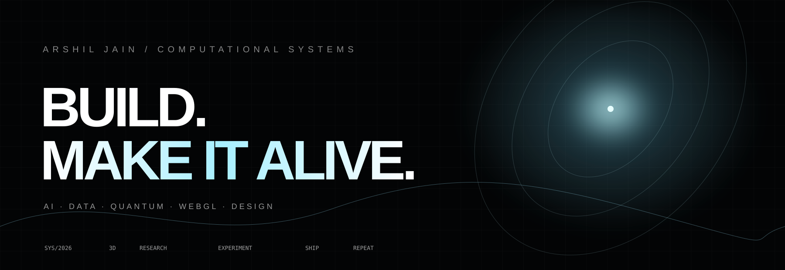

 

  

---

## `00 / SIGNAL`

I build where **engineering, mathematics, data, and visual design** overlap.

`AI / ML` · `Data Science` · `Algorithms` · `Quantum Computing` · `Qiskit` · `Three.js` · `WebGL` · `GLSL` · `Automation`

The loop:

~~~text
IDEA → PROTOTYPE → BREAK IT → UNDERSTAND WHY → REBUILD → SHIP
~~~

## `01 / SELECTED SYSTEMS`

<table>
<tr><td width="50%" valign="top">

### ◉ Lusion Systems

Technical graphics research around custom GLSL, GPGPU dynamics, screen-space techniques, runtime behavior and mathematical geometry.

**[OPEN REPO ↗](https://github.com/arshiljain/lusionw)**

</td><td width="50%" valign="top">

### △ Algorithm Laboratory

Readable implementations of algorithms plus experiments in machine learning, quantitative finance, game theory and quantum circuits.

**[OPEN LAB ↗](https://github.com/arshiljain/DSAPP)**

</td></tr>
<tr><td width="50%" valign="top">

### ◇ Creative Web

Art-directed frontend experiments exploring motion, typography, interaction and WebGL.

**[PORTFOLIO ↗](https://github.com/arshiljain/portfolio)**

</td><td width="50%" valign="top">

### ⌘ Developer Lab

Private workspace for GitHub automation and developer tooling.

**[DEVELOPER LAB ↗](https://github.com/arshiljain/Github-Bot)**

</td></tr>
</table>

## `02 / 3D CONTRIBUTION WALL`

This profile includes an automated 3D contribution renderer driven by GitHub's real contribution data. The official action generates the 3D calendar as SVG assets inside the profile repository. citeturn408786search0

## `03 / ENTER THE LAB`

### **[OPEN THE INTERACTIVE 3D SITE →](./index.html)**

A real Three.js scene with an orbital particle system, cursor-reactive motion, project cards, and the same visual language as this profile.

## `04 / RANGE`

~~~text
ALGORITHMS      ██████████
CREATIVE WEB    ██████████
AI / ML         ████████░░
QUANTUM         ████████░░
GAME THEORY     ███████░░░
QUANT FINANCE   ██████░░░░
~~~

## `05 / THE RULE`

> Make it useful.
>
> Make it beautiful.
>
> Then make it strange.

ARSHILJAIN · 2026

